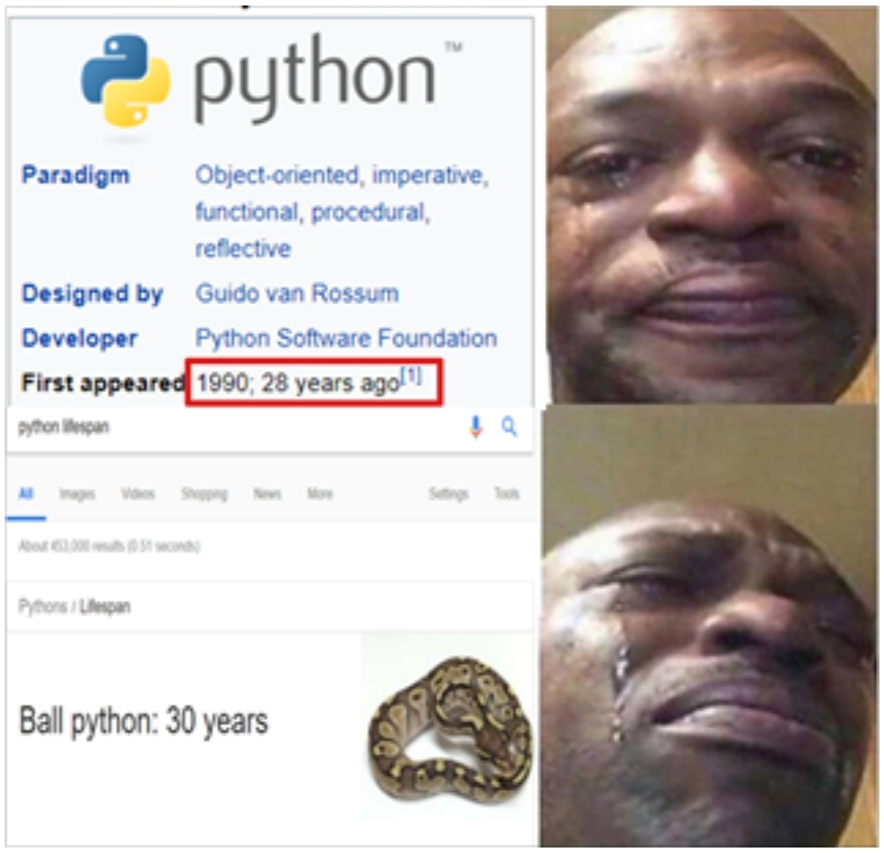

# Репозиторий с дополнительными материалами по python

В этом репозитории распологаются материалы для изучения языка программирования python. Здесь есть:

- задачи-минимумы **[ЗМ];**
- задачи средней сложности  **[ЗСС];**
- готовые решения типовых задач.

Все материалы разбиты на категории и размещены в папках с соответствующими названиями.



## Обозначения и структура папок
Название папки соответствует теме, материалы по которой в ней хранятся.

В каждой папке есть папка **"Задачи"** -- в ней находятся все задачи по теме.
* **[ЗМ]** - обозначение задач-минимумов;
* **[ЗСС]** - обозначение задач средней сложности;

Помимо папки "Задачи" в директории темы есть файлы с кодом _(*.py)_, которые содержат готовые решения типовых задач. Эти решения можно использовать на занятих для написания собственного кода.
## Уровни сложности задач
Задачи в репозитории разделены на 2 типа: **[ЗМ] задачи-минимумы** и **[ЗСС] задачи средней сложности**. 

_Если вы сомневаетесь в том, что освоили тему, попробуйте решить все приведенные к ней задачи-миниумы_. Если сделать это удалось -- вы понимаете тему настолько, сколько хватит для продолжения обучения по курсу. Если у вас возникли проблемы с решением задач-минимумов, советую обратиться ко мне.

Если вы успешно решили задачи средней сложности, значит хорошо поняли тему и можете продолжать обучение.

## Формат задач 
Каждая задача соджержит несколько элементов.

1. Текст задачи.
2. Примеры корретного ввода и верного вывода.

Например:
```
Выведите на экран их сумму двух введенных чисел.
---
Ввод 1:
5
9
Вывод 1:
14
---
Ввод 2:
4
-3
Вывод 2:
1
```

Первая строка содержит информацию о задаче, которую нужно решить. 

Остальные строки означают, что если в качестве ввода программе поступили числа ```5``` и ```9```, то вывести она должна ```14```, а если ввод ```4``` и ```-3```, то верный вывод -- ```1```.


## Контакты
Вк: [pluuutoo](http://vk.com/pluuutoo)

Дискорд: [ytt#1996]()

Ссылка-приглашение на дискорд сервер: [тык](https://discord.gg/mzcANHwNQx)

Почта: [liannosoul@gmail.com](mailto:liannosoul@gmail.com)
